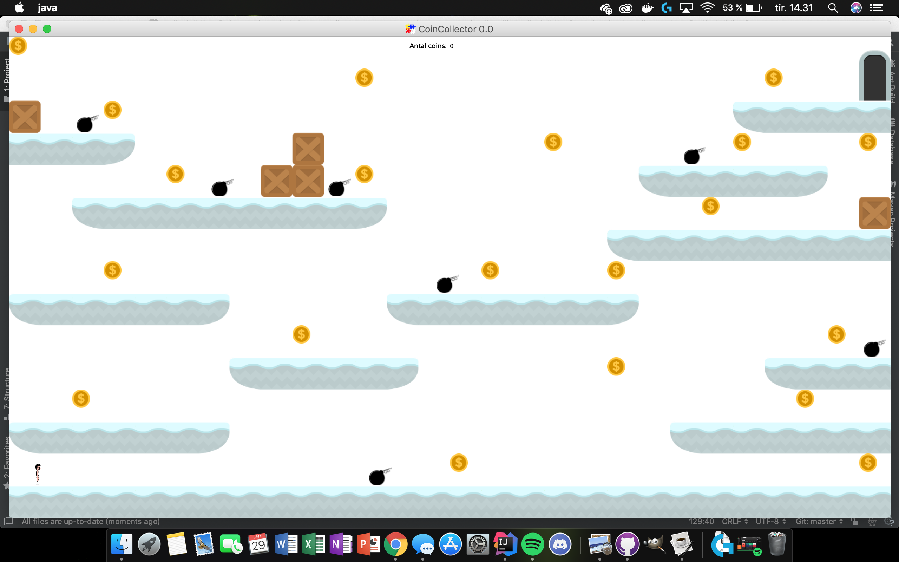

# Coincollector

## Januaropgave

**Vi har fået til opgagve at lave et spil, hvor JavaFXGL vil væres vores udgangspunkt for spilopbyggelsen** 
Jeg har valgt at lave et spil kaldet "coincollector". Det går såmænd bare ud på at samle alle mønter på banen, inden man når målet.
Ideen er, at jeg skal have en timer som også kan fortælle hvor hurtig man er om at opnå sejren.   

Der bliver brugt piltast til venstre og højre samt mellemrumstast for at styre spilleren.
Nogle af mine platforme er med vilje for høje til at spilleren kan hoppe op på dem. Det er her meningen at man skal lave et ekstra hop på muren.
